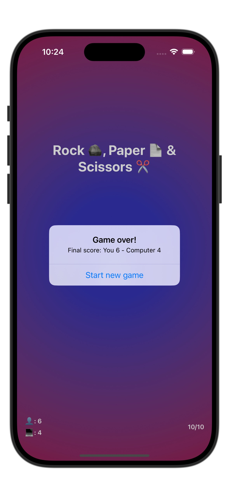

# Rock, Paper, Scissors

This is a simple game built with SwiftUI as part of Challenge 2 from the [100 Days of SwiftUI](https://www.hackingwithswift.com/100/swiftui) by Paul Hudson. In this game, the player competes against the computer in the classic game of Rock, Paper, Scissors. The app tracks scores for both the player and the computer, and the game ends after 10 rounds.

## Overview

**Rock, Paper, Scissors** introduces and reinforces SwiftUI concepts, including:

- Stack-based layout using `VStack`, `HStack`, and `ZStack`
- Custom backgrounds with gradients
- Buttons with actions to update game state
- Alerts to display feedback and game results
- Subviews for clean and modular UI components

## Features

- **Randomized Outcomes**: Each round, the computer randomly wins or loses, providing an element of unpredictability.
- **Score Tracking**: Both the player's and computer's scores are tracked, updating based on wins and losses.
- **Rounds and Game Over**: The game tracks the number of rounds and shows a "Game Over" alert after 10 rounds.
- **Reusable Subviews**: Uses a custom `OptionButton` for each game option (Rock, Paper, Scissors), promoting modularity.
- **Feedback Alerts**: Alerts display results and the opponent's choice for each round.

## Code Highlights

### 1. Custom Views and Button Actions

The game options (Rock, Paper, Scissors) are presented as buttons in a custom `OptionButton` subview. Each button triggers an action to determine the result:

```swift
struct OptionButton: View {
    let option: GameOption
    let action: (GameOption) -> Void

    var body: some View {
        Button(option.text) {
            action(option)
        }
        .font(.largeTitle)
    }
}
```

### 2. Game Logic with Helper Methods

The main view logic includes helper functions to:

  • Determine the game outcome
  • Update scores
  • Generate an alert message based on the player’s and computer’s choices
  • Manage the round count and reset for a new game

Example of helper methods:

```swift
private func determineOutcome() {
    alertTitle = youWin ? "You won" : "You lost"
}

private func updateScores() {
    if youWin {
        playerPoints += 1
    } else {
        computerPoints += 1
    }
}

private func generateAlertMessage(for option: OptionButton.GameOption) {
    let opponentChoice = youWin ? option.losingOpponent : option.winningOpponent
    alertMessage = "You chose \(option.text), I chose \(opponentChoice.text)"
}
```

### 3. Background and Styling

The game uses a RadialGradient background to create a visually appealing look and better contrast for the game content:

```swift
ZStack {
    RadialGradient(
        gradient: Gradient(colors: [
            Color(red: 0.2, green: 0.2, blue: 0.7),
            Color(red: 0.6, green: 0.1, blue: 0.3)
        ]),
        center: .center,
        startRadius: 100,
        endRadius: 500
    )
    .ignoresSafeArea()
}
```

## How to Play

  1. **Choose an Option**: Tap on one of the options (Rock, Paper, or Scissors).
  2. **View Results**: An alert will show whether you won or lost the round, along with the computer’s choice.
  3. **Score Tracking**: Check your score against the computer’s score as you play through rounds.
  4. **Game Over**: After 10 rounds, the game ends, and you’ll see the final score. You can then start a new game.

## Screenshots

| Demo                           |
| ------------------------------ |
|  |
|  |
|  |
|  |

## Lessons Learned

This project helped reinforce SwiftUI basics, including:
  • Creating layouts with VStack, HStack, and ZStack
  • Using alerts to provide user feedback
  • Handling button actions to update state
  • Building modular, reusable views
  • Applying custom backgrounds with gradients

## License

This project is licensed under the MIT License.
